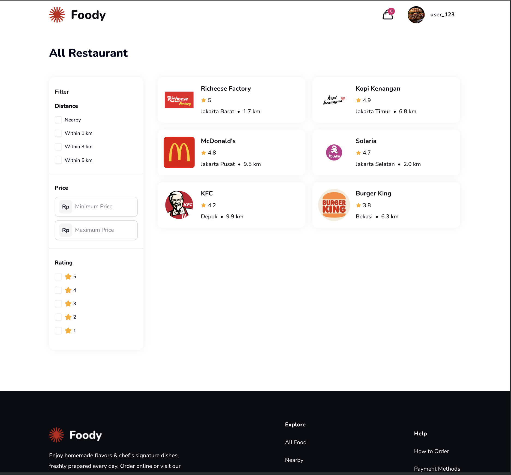
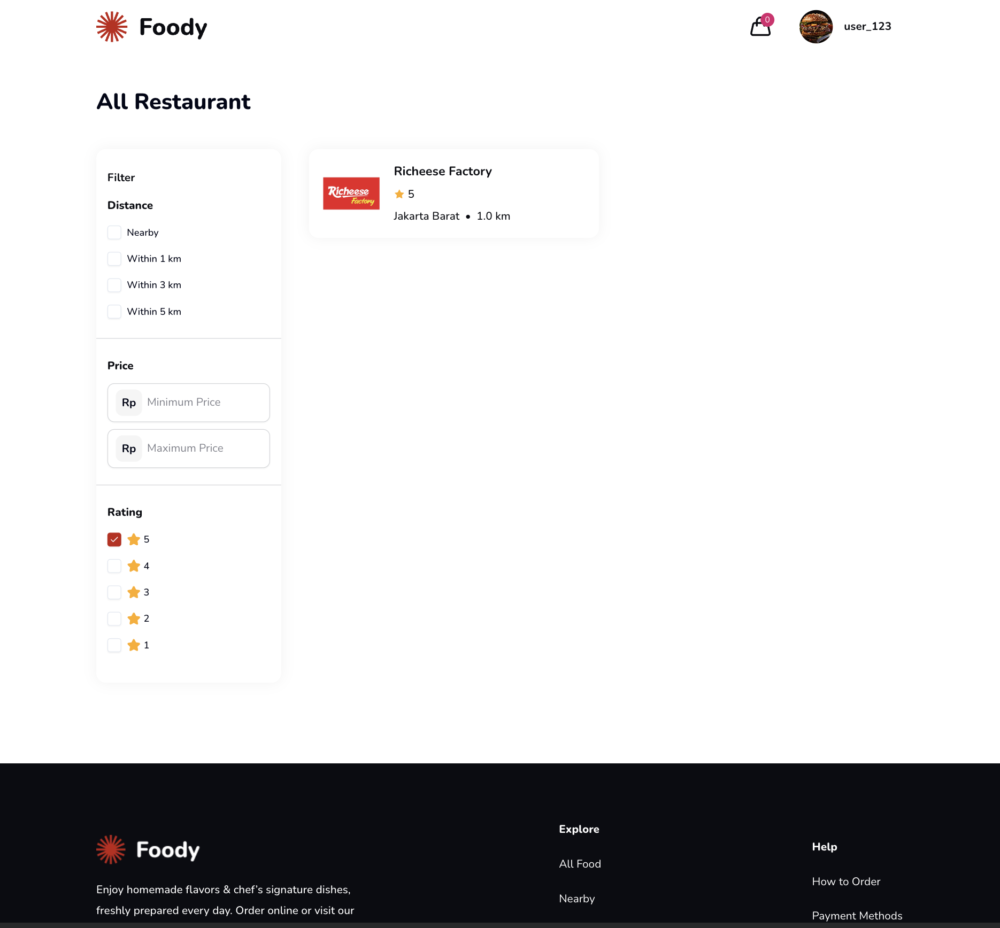
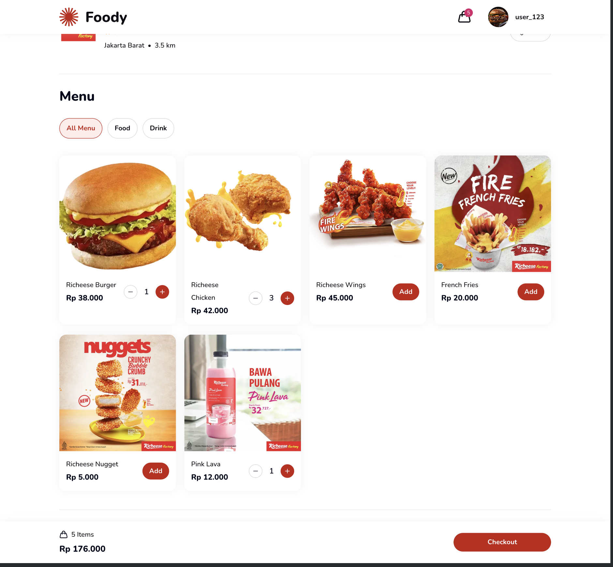
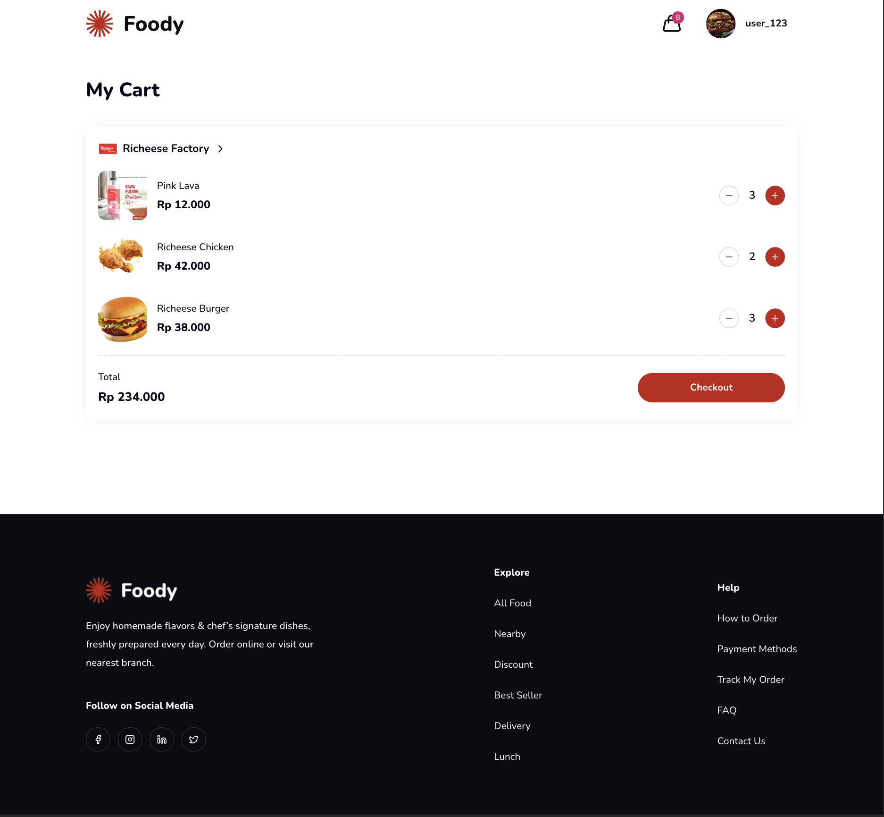
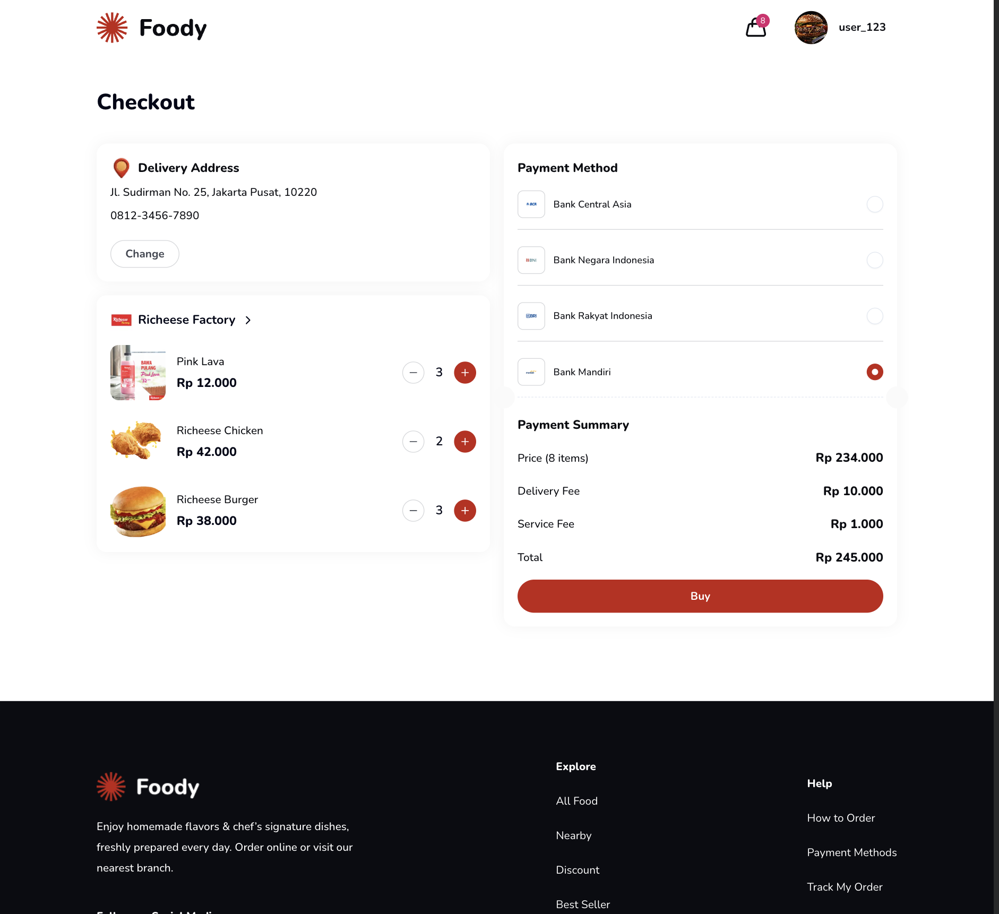
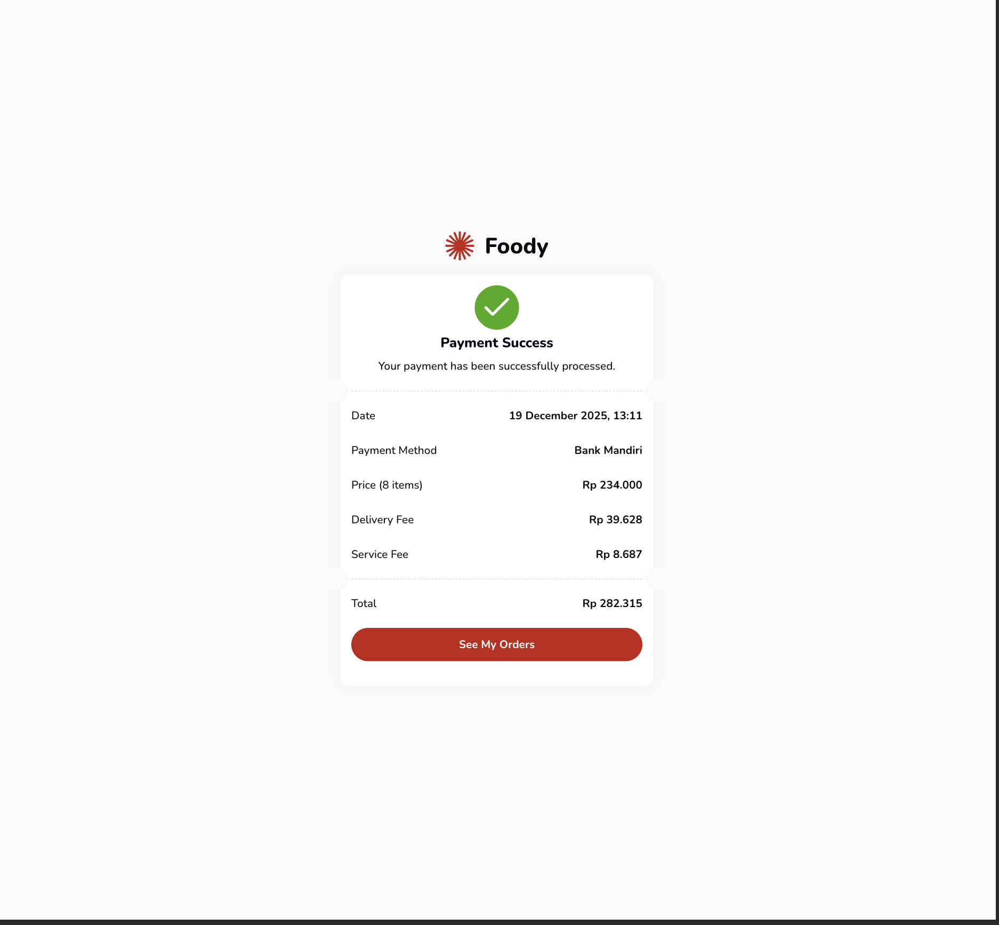
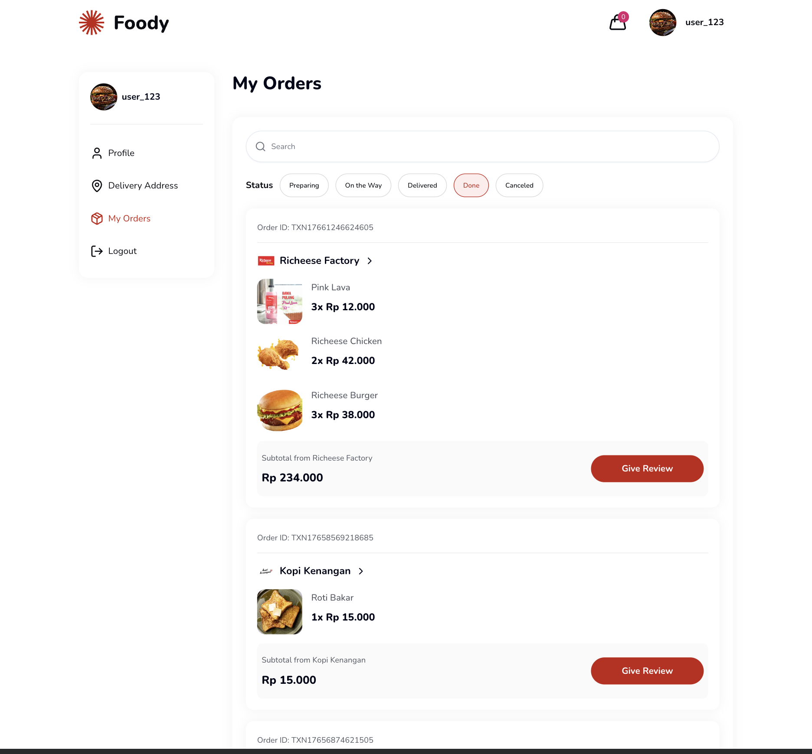
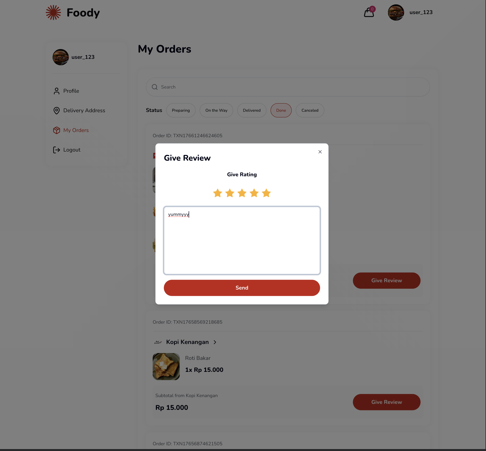
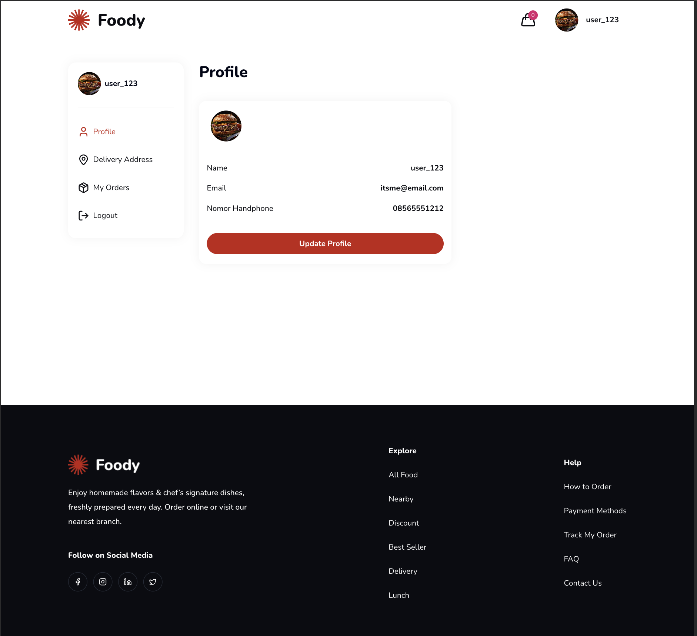
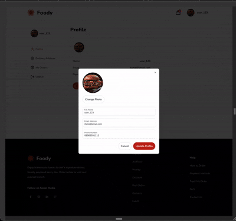

<div align="center">

# 🍽️ Restaurant App

### A Modern Feature-Rich Food Ordering Platform

[](https://nextjs.org/)
[](https://react.dev/)
[](https://www.typescriptlang.org/)
[](https://tailwindcss.com/)
[](https://tanstack.com/query/v5)
[](https://redux.js.org/)
[](https://react-hook-form.com/)

[Features](#-features) • [Tech Stack](#-tech-stack) • [Getting Started](#-getting-started) • [Screenshots](#-screenshots)

</div>

---

## 📖 Overview

Restaurant App is a comprehensive food ordering platform designed to provide a seamless dining experience. Users can explore various restaurants, browse menus, manage their cart, and place orders with ease. Built with the latest web technologies, it ensures high performance, accessibility, and a stunning user interface.

## ✨ Features

### 🔐 Authentication & Security

- **Secure Login & Registration** - Robust authentication system for users.
- **Protected Routes** - Ensures secure access to user-specific pages.

### 🍽️ Restaurant & Menu Discovery

- **Restaurant Listing** - Browse a wide variety of restaurants with advanced filtering.
- **Menu Details** - Detailed views of food items with descriptions and prices.
- **Category Browsing** - Easy navigation through different food categories.
- **Search Functionality** - Quickly find restaurants or specific dishes.

### 🛒 Cart & Checkout

- **Dynamic Cart Management** - Add, remove, or update items in real-time.
- **Streamlined Checkout** - A smooth, multi-step checkout process.
- **Order Summary** - Clear breakdown of costs before confirmation.
- **Checkout Success** - Visual confirmation upon successful order placement.

### 👤 User Profile & Orders

- **Profile Management** - Update personal information and avatar.
- **Order History** - View past orders and their status ("My Order").
- **Review System** - Leave reviews and ratings for restaurants and menu items.

### 🎨 UI/UX Excellence

- **Responsive Design** - Fully optimized for mobile, tablet, and desktop.
- **Optimistic UI** - Instant feedback interactions (e.g., adding to cart).
- **Interactive Elements** - Smooth carousels, modals, and dropdowns.
- **Toast Notifications** - Real-time feedback for user actions.

## 🛠 Tech Stack

### Frontend Framework

<div align="left">

| Technology                                                                                               | Description                    | Version |
| :------------------------------------------------------------------------------------------------------- | :----------------------------- | :------ |
|           | React framework with SSR & SSG | 16.0.8  |
|                 | UI library                     | 19.2.1  |
|  | Type-safe JavaScript           | 5.0     |

</div>

### Styling & UI

<div align="left">

| Technology                                                                                                    | Description                    | Version |
| :------------------------------------------------------------------------------------------------------------ | :----------------------------- | :------ |
|  | Utility-first CSS framework    | 4.0     |
|             | Unstyled accessible components | Latest  |
|                   | Beautiful icon library         | 0.556.0 |
|      | Lightweight carousel library   | 8.6.0   |

</div>

### State Management & Data Fetching

<div align="left">

| Technology                                                                                                  | Description             | Version |
| :---------------------------------------------------------------------------------------------------------- | :---------------------- | :------ |
|    | Global state management | 2.11.1  |
|  | Server state management | 5.90.12 |
|                    | HTTP client             | 1.13.2  |

</div>

### Form Handling & Validation

<div align="left">

| Technology                                                                                                            | Description       | Version |
| :-------------------------------------------------------------------------------------------------------------------- | :---------------- | :------ |
|  | Form management   | 7.68.0  |
|                                    | Schema validation | 4.1.13  |

</div>

## 🚀 Getting Started

### Prerequisites

- Node.js 18+ installed
- npm, yarn, or pnpm package manager

### Installation

1. **Clone the repository**

   ```bash
   git clone https://github.com/hanssav/wph-restaurant-app
   cd wph-restaurant-app
   ```

2. **Install dependencies**

   ```bash
   npm install
   # or
   yarn install
   # or
   pnpm install
   ```

3. **Set up environment variables**

   Create a `.env.local` file in the root directory and configure your API endpoints:

   ```env
   NEXT_PUBLIC_API_URL=your_api_url_here
   ```

4. **Run the development server**

   ```bash
   npm run dev
   # or
   yarn dev
   # or
   pnpm dev
   ```

5. **Open your browser**

   Navigate to [http://localhost:3000](http://localhost:3000)

### Build for Production

```bash
npm run build
npm start
```

## 📸 Screenshots

### Authentication

<div align="center">
  
  
</div>

### Home Page

<div align="center">
  
</div>

### Restaurant Listing & Filters

<div align="center">
  
  
</div>

### Restaurant Details

<div align="center">
  
  
</div>

### Cart & Checkout

<div align="center">
  
  
</div>

### Checkout Success

<div align="center">
  
</div>

### My Orders & Reviews

<div align="center">
  
  
</div>

### User Profile

<div align="center">
  
</div>

### Optimistic UI & Interactions

<div align="center">
  
  <p><em>Seamless interactions with optimistic UI updates</em></p>
</div>

## 🏗 Project Structure

```
src/
├── app/                    # Next.js app directory (App Router)
│   ├── (users)/            # User-facing routes (Home, Restaurant, Profile)
│   ├── auth/               # Authentication routes (Login, Register)
│   ├── layout.tsx          # Root layout
│   └── globals.css         # Global styles
├── components/             # React components
│   ├── container/          # Container/Layout components
│   ├── pages/              # Page-specific components
│   └── ui/                 # Reusable UI components (buttons, inputs, etc.)
├── hooks/                  # Custom React hooks
├── lib/                    # Utility libraries and schema definitions
├── services/               # API service layers
├── store/                  # Redux store configuration
├── types/                  # TypeScript type definitions
└── constants/              # Application constants
```

## 🤝 Contributing

Contributions are welcome! Please feel free to submit a Pull Request.

## 📝 License

This project is licensed under the MIT License.

## 👨‍💻 Author

**Handi Irawan**

---

<div align="center">
  <p>Built with ❤️ using Next.js and React</p>
  <p>⭐ Star this repo if you find it helpful!</p>
</div>
